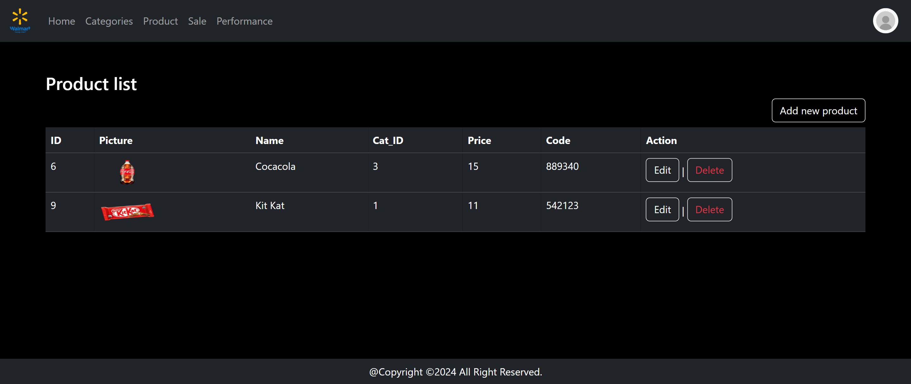

Project_Post

A PHP-based web application developed as a school project to demonstrate user authentication and CRUD (Create, Read, Update, Delete) operations using MySQL, focusing on core backend concepts and database interaction.



📌 Features

✔ User Registration (register.php)

✔ User Login (logIn.php)

✔ Session Management to keep users logged in (session_management.php)

✔ Logout (signOut.php)

✔ CRUD operations with data stored in the database (users can be created, viewed, updated, deleted)

✔ MySQL database connection (Connection.php)

✔ Basic styling with CSS (style.css)

✔ SQL file to generate required database (project_post.sql)

🗂 Project Structure

Admin/

Users/

Connection.php

index.php

logIn.php

register.php

session_management.php

signOut.php

project_post.sql

style.css

🚀 Setup Guide (Run Locally)

1. Clone the repository

   git clone https://github.com/SousdeyKim/Project_Post.git

   cd Project_Post
   
2. Create the database

Open phpMyAdmin by visiting:

http://localhost/phpMyAdmin

Create a new database named:

project_post

Import the SQL file project_post.sql using the Import tab — this will create your needed tables.

3. Update the database connection

Open Connection.php and set your database credentials:

```php

<?php
$conn = new mysqli('localhost', 'root', 'root', 'project_post');

If you’re using XAMPP default settings, it should be:
```
```php
$conn = new mysqli('localhost', 'root', '', 'project_post');
```
4. Start the server
Option A — Using XAMPP

Start Apache and MySQL from the XAMPP Control Panel.

Move this project to the XAMPP htdocs folder:

C:\xampp\htdocs\Project_Post

Visit in your browser:

http://localhost/Project_Post/

Option B — Using PHP built‑in server

From the project directory:

php -S localhost:8000

Open in your browser:

http://localhost:8000/logIn.php

🧠 How to Use

Visit http://localhost/Project_Post/

If you don’t have an account, click Register and fill out the form

After registering, log in

Once logged in, you’ll see pages where you can create, view (read), update, or delete records (CRUD operations)
